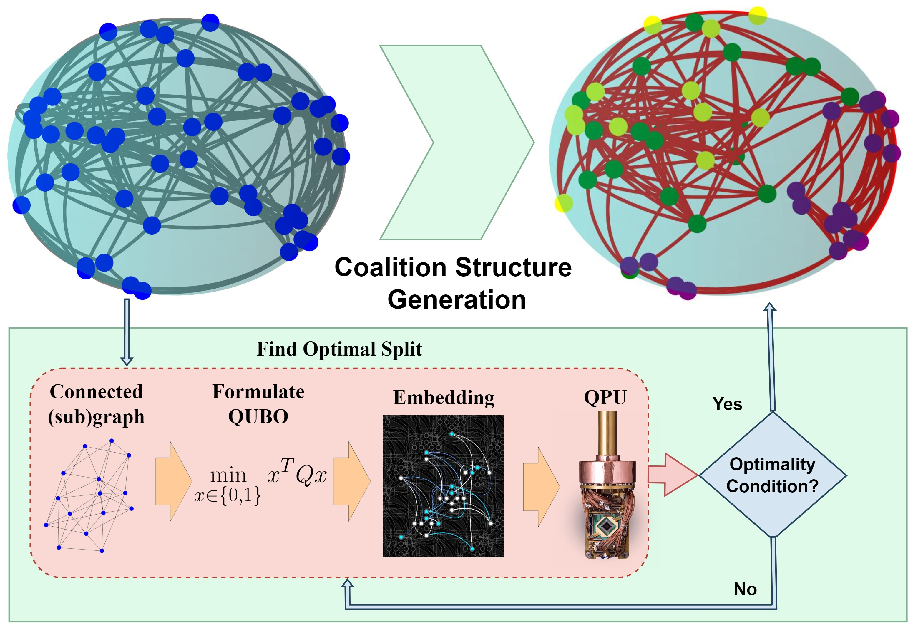
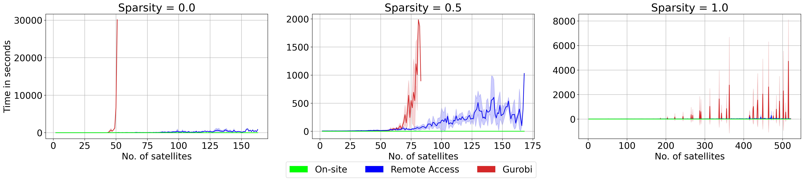
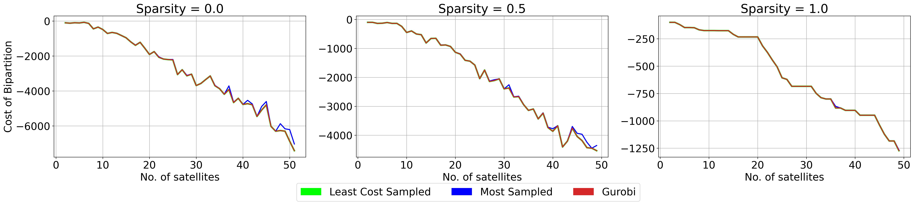

# **LEO-satellites-coalition: Quantum Annealing-Based Algorithm for Efficient Coalition Formation Among LEO Satellites**

[](https://www.gnu.org/licenses/old-licenses/lgpl-2.1.html)  
[](https://arxiv.org/abs/2408.06007)  
[](https://www.linkedin.com/in/supreethmv/)  
[](https://www.supreethmv.com)

---

## **Overview**

This repository contains the official code for the paper **"Quantum Annealing-Based Algorithm for Efficient Coalition Formation Among LEO Satellites"**, accepted at the _4th International Workshop on Quantum Software Engineering and Technology_ co-located with IEEE International Conference on Quantum Computing and Engineering (IEEE Quantum Week) held at Montréal, Canada. This repository provides the full pipeline for reproducing the experimental results


<div align="left">
  
</div>

### **Paper Preprint**
The preprint is available on [arXiv](https://arxiv.org/abs/2408.06007).


<div align="center">
  
</div>

The paper introduces a hybrid quantum-classical approach to partition called **GCS-Q** for clustering Low Earth Orbit (LEO) satellites into efficient coalitions, formulated as a **Coalition Structure Generation (CSG)** problem. The **GCS-Q** algorithm utilizes the **D-Wave Advantage quantum annealer** for solving the problem and compares the performance against the classical **Gurobi** solver.

### **Abstract**  
The increasing number of Low Earth Orbit (LEO) satellites, driven by lower manufacturing and launch costs, is proving invaluable for Earth observation missions and low-latency internet connectivity. However, as the number of satellites increases, the management of this vast network becomes challenging, highlighting the need for clustering satellites into efficient groups. This paper formulates the clustering of LEO satellites as a coalition structure generation (CSG) problem and leverages quantum annealing to solve it. The approach is evaluated using real-world three-line element set (TLE) data for Starlink satellites from Celestrak.

### **Paper Citation**
If you use this repository or find it helpful, please consider citing:

```bibtex
@article{venkatesh2024quantum,
  title={Quantum Annealing-Based Algorithm for Efficient Coalition Formation Among LEO Satellites},
  author={Venkatesh, Supreeth Mysore and Macaluso, Antonio and Nuske, Marlon and Klusch, Matthias and Dengel, Andreas},
  journal={arXiv preprint arXiv:2405.14405},
  year={2024}
}
```

---

## **Repository Structure**

```bash
LEO-satellites-coalition/
│
├── notebooks/
│   ├── Annealer_vs_Gurobi_optimalSplit.ipynb   # Comparison between Quantum Annealing and Gurobi Solver
│   ├── Experiments.ipynb                       # Running the experiments for coalition formation
│   └── visualize.ipynb                         # Visualization of results and plots
│
├── plots/                                      # Pre-generated plots from experiments
│   ├── links.jpg
│   ├── quality.jpg
│   ├── runtime.jpg
│   └── sat_globe_1.jpg
│   └── sat_globe_2.jpg                         # Globe images visualizing satellite coalitions
│
├── results/
│   ├── annealer_samples/                       # Results from Quantum Annealer (D-Wave)
│   └── Gurobi_results/                         # Results from Gurobi Solver
│
├── singleSplitresults/
│   ├── annealer_samples/                       # Single split experiment results (Quantum Annealer)
│   ├── consolidated_reports/                   # Consolidated experiment reports
│   ├── experiment_logs/                        # Logs of the experiments
│   └── qputimes_consolidated/                  # Consolidated quantum processing times
│
├── LICENSE                                     # License file (LGPL v2.1)
├── README.md                                   # Project documentation (this file)
└── starlink_tle_data.pkl                       # TLE data for Starlink satellites from CelesTrak.org
```

---

## **Getting Started**

### **Install Dependencies**

The required packages include:
- Quantum tools (D-Wave Ocean SDK, Qiskit)
- Classical solvers (Gurobi)
- Data handling and plotting (Pandas, Matplotlib)

### **Running the Experiments**

- **Annealer vs Gurobi Comparison**: Run the `notebooks/Annealer_vs_Gurobi_optimalSplit.ipynb` notebook to compare the performance of the **D-Wave Quantum Annealer** against the classical **Gurobi** solver to find the optimal single split for varying sizes of the graph with varying sparsities.
- **Experimentation**: The `notebooks/Experiments.ipynb` allows you to run the GCS-Q experiments for (real-world) TLE satellite data extracted from celestrak.org to find their positions.
- **Visualization**: Use `notebooks/visualize.ipynb` to generate and view visual plots for quality, runtime, and coalition structures of satellites.

---

## **Results Overview**

This section contains the results from the quantum annealer and classical solvers, along with visual comparisons of their performance.

### **Runtime**

<div align="center">
  
</div>

### **Quality**

<div align="center">
  
</div>

The results show that **GCS-Q** algorithm equipped with **D-Wave Advantage** annealer significantly outperforms classical methods in runtime while maintaining a high solution quality for coalition formation.

---


## **License**

This project is licensed under the **GNU Lesser General Public License v2.1**. See the [LICENSE](LICENSE) file for more details.

---

## **Contact**

**Supreeth Mysore Venkatesh**  

For any inquiries, please reach out to:

- Email: supreeth.mysore@dfki.de  
- LinkedIn: [Supreeth Mysore Venkatesh](https://www.linkedin.com/in/supreethmv/)  
- Website: [www.supreethmv.com](https://www.supreethmv.com)


## Contributors

[](https://www.supreethmv.com)
